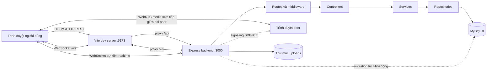
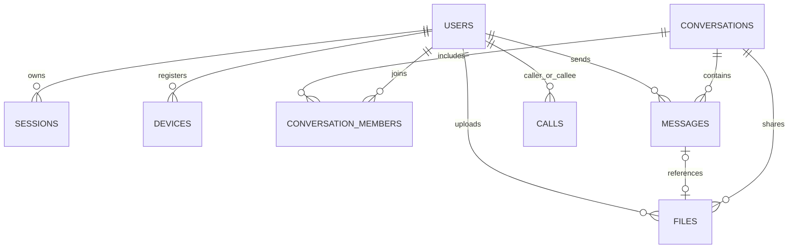

# BÁO CÁO KHẢO SÁT HỆ THỐNG LAN-MEDIA

> Tài liệu khảo sát mã nguồn tại thời điểm 02/10/2026. Nội dung mô tả hiện trạng repository, không phải đặc tả cho các chức năng tương lai. Các luồng được suy ra từ frontend, API, service, repository, migration và cấu hình đang có.

## 1. Tóm tắt dự án

LAN-Media là ứng dụng giao tiếp đa phương tiện ưu tiên mạng LAN, hiện được tổ chức theo **modular monolith**: frontend React/Vite và backend Express/Node chạy như các thành phần riêng trong cùng repository; backend cung cấp REST API, WebSocket, xác thực, nghiệp vụ và truy cập MySQL. Tệp được truyền qua HTTP và lưu trong thư mục local, còn signaling cuộc gọi dùng WebSocket và media dùng WebRTC giữa trình duyệt.

Những năng lực backend/frontend có triển khai đáng kể:

- Đăng ký, đăng nhập, khôi phục phiên đăng nhập bằng cookie và đăng xuất.
- Danh bạ người dùng, trạng thái online dựa trên kết nối WebSocket.
- Hội thoại trực tiếp và nhóm, lịch sử tin nhắn, tin nhắn thời gian thực, trạng thái đang nhập.
- Tải tệp lên, phát thông báo tệp như một tin nhắn, liệt kê tệp trong hội thoại và tải xuống có kiểm tra quyền.
- Gọi thoại/video 1-1: báo gọi, chấp nhận/từ chối/kết thúc, trao đổi SDP/ICE qua WebSocket và truyền media bằng WebRTC.
- Migration MySQL tự chạy khi backend khởi động; cấu hình chạy cục bộ hoặc qua Docker Compose.

Các giới hạn cần thể hiện đúng khi thuyết trình:

- “LAN-first” là định hướng triển khai trên mạng nội bộ; ứng dụng **không tự tìm máy chủ LAN** hiện nay. Có module `LanDiscovery`/`NetworkManager`, nhưng chưa được tích hợp vào luồng khởi động hay UI.
- Tệp lưu trên filesystem cục bộ của máy chạy backend; chưa có object storage, đồng bộ/replication hay quét mã độc.
- Gọi có signaling và mã phía WebRTC, nhưng server giữ trạng thái cuộc gọi trong bộ nhớ; bảng `calls` hiện chưa được dùng bởi `CallService` để lưu lịch sử. Không có TURN được cấu hình sẵn ngoài ICE server STUN mặc định.
- UI có nhiều trang/tính năng mẫu. `ChatPage` là giao diện chat thật dùng API; `FilesPage` và `CallPage` được route trực tiếp là placeholder. Trong `App`, route đã đăng nhập thường render `DemoWorkspace`; vì vậy tab trong workspace mẫu không đồng nghĩa với một màn hình sản phẩm hoàn chỉnh.
- README ghi rõ giai đoạn WebRTC chưa triển khai, trong khi mã hiện tại đã có signaling/WebRTC. Nên hiểu README bị chậm cập nhật ở điểm này; báo cáo lấy mã nguồn hiện có làm căn cứ và ghi nhận khác biệt.

## 2. Kiến trúc tổng thể

### 2.1 Sơ đồ thành phần



Trong môi trường phát triển, trình duyệt gọi cùng origin Vite. Vite chuyển tiếp `/api` và `/ws` tới backend. Khi deploy không dùng Vite dev server, cần thay thế lớp proxy bằng web server/reverse proxy tương đương và cấu hình HTTPS/WSS phù hợp. Backend mặc định bind `0.0.0.0:3000`; Vite bind `0.0.0.0:5173`.

### 2.2 Các lớp backend

1. **Routes** khai báo endpoint và áp dụng `requireAuth` cho endpoint riêng tư.
2. **Controllers** chuyển HTTP request thành lời gọi nghiệp vụ, lấy user đã xác thực từ `response.locals`, định dạng response và chuyển lỗi cho middleware.
3. **Services** kiểm tra quy tắc nghiệp vụ, quyền thành viên/quản trị, giới hạn dữ liệu và điều phối repository.
4. **Repositories** đóng gói truy vấn MySQL theo thực thể.
5. **Database/Migrations** tạo connection pool `mysql2/promise`, tuần tự áp dụng schema version.
6. **WebSocket handlers** xác thực phiên ở bước upgrade/connection, giải mã event, gọi service và gửi event tới các kết nối phù hợp.

Đây là modular monolith, không phải microservices: các module dùng chung tiến trình backend, database, cấu hình và bộ quản lý kết nối.

### 2.3 Frontend

Frontend là SPA React + TypeScript. `App.tsx` xử lý route đơn giản dựa trên `window.history`, trạng thái đăng nhập, health check, WebSocket và call hook cấp ứng dụng. `api/` gom các client HTTP/realtime; `hooks/` giữ trạng thái và hành vi auth/chat/call; `pages/` định nghĩa màn hình; `components/` chứa thành phần dùng lại; CSS được tổ chức theo global styles và trang.

`useWebSocket`/`RealtimeClient` dùng một kết nối realtime chia sẻ; backend xác thực cookie phiên ở WebSocket handshake. `useChat`/`ChatPage` gọi REST cho danh sách và lịch sử, dùng WebSocket cho cập nhật đẩy. `useCall` dựng `RTCPeerConnection` trên trình duyệt và gửi tín hiệu điều khiển qua cùng WebSocket.

## 3. Cây thư mục và trách nhiệm

```text
LAN_Media/
├── backend/
│   ├── src/
│   │   ├── controllers/       # HTTP handlers; lắp service/repository
│   │   ├── core/
│   │   │   ├── config/        # Đọc/kiểm tra biến môi trường
│   │   │   ├── database/      # Pool MySQL, migration runner, migrations
│   │   │   ├── errors/        # ApiError dùng chung
│   │   │   ├── middleware/    # CORS, not-found, error handler
│   │   │   ├── network/       # NetworkManager/LanDiscovery (chưa tích hợp)
│   │   │   └── security/      # Hash mật khẩu, token, auth middleware
│   │   ├── models/            # Kiểu miền User/Message/File/Call...
│   │   ├── repositories/      # Truy vấn và ánh xạ MySQL
│   │   ├── routes/            # Khai báo endpoint Express
│   │   ├── services/          # Auth, chat, file, call, user, health...
│   │   ├── types/             # Khai báo mở rộng kiểu Express
│   │   ├── websocket/         # WebSocket server, quản lý kết nối, handlers
│   │   └── main.ts            # Lắp app, WS, migration và listen
│   └── tsconfig.json
├── frontend/
│   ├── src/
│   │   ├── api/               # Auth/Chat/File/User/Health và realtime client
│   │   ├── components/        # common, chat, call
│   │   ├── hooks/             # useAuth/useChat/useCall/useWebSocket
│   │   ├── pages/             # Login/Register/Chat/Files/Call/Settings...
│   │   ├── styles/            # reset, variables, global, demo
│   │   ├── App.tsx            # Điều phối route, auth và workspace
│   │   └── main.tsx           # Điểm vào React
│   ├── index.html
│   ├── vite.config.ts         # HTTPS tùy chọn, proxy REST và WebSocket
│   └── tsconfig.json
├── docs/database/             # Hướng dẫn DB và setup.sql
├── tests/
│   ├── unit/                  # Test service/repository/security
│   └── integration/           # Health/auth/chat/files
├── storage/                   # Các thư mục placeholder theo loại nội dung
├── uploads/                   # Kho file local đang cấu hình mặc định
├── certs/                     # Chứng thư LAN tùy chọn, không commit
├── docker-compose.yml         # App Node và MySQL
├── package.json               # Scripts và dependencies gốc
├── package-lock.json
├── tsconfig.json
├── .env.example               # Mẫu biến môi trường
├── .gitignore
├── README.md
└── BAOCAO.md                  # Báo cáo khảo sát này
```

`backend/dist`, `frontend/dist`, `node_modules`, `.env`, chứng thư và dữ liệu upload bị ignore khỏi Git. `storage/files`, `storage/images`, `storage/videos`, `storage/temporary` chỉ có `.gitkeep`; luồng upload hiện dùng `UPLOAD_DIR` mặc định `./uploads`, không dùng các thư mục phân loại đó.

### 3.1 Một số file quan trọng

| File | Vai trò |
|---|---|
| `backend/src/main.ts` | Tạo Express/HTTP server, gắn WebSocket, chạy migrations rồi listen; nếu DB lỗi vẫn listen ở chế độ degraded. |
| `backend/src/core/security/AuthMiddleware.ts` | Đọc cookie phiên, kiểm tra hash token/session và gắn danh tính vào request. |
| `backend/src/websocket/WebSocketServer.ts` | Chặn path/origin không hợp lệ, xác thực cookie khi kết nối, phân luồng event chat/call. |
| `backend/src/websocket/ConnectionManager.ts` | Theo dõi nhiều socket trên mỗi user, presence và gửi/broadcast event. |
| `backend/src/services/ChatService.ts` | Quy tắc hội thoại, quyền truy cập, giới hạn nội dung và quản lý thành viên. |
| `backend/src/services/FileService.ts` | Parse multipart, kiểm tra quyền/loại/kích thước, ghi disk và metadata. |
| `backend/src/services/CallService.ts` | Trạng thái cuộc gọi đang chạy trong bộ nhớ. |
| `frontend/src/App.tsx` | Khôi phục phiên, điều hướng, health status, realtime/call hook và render workspace. |
| `frontend/src/pages/ChatPage/ChatPage.tsx` | Giao diện chat, danh bạ, hội thoại, tệp, gửi/nhận realtime. |
| `frontend/src/hooks/useCall.ts` | Thu media, khởi tạo WebRTC peer, xử lý SDP/ICE, mute/camera/cleanup. |
| `frontend/src/api/FileApi.ts` | Upload XHR có tiến độ; download stream và lưu file phía trình duyệt. |

## 4. Công nghệ và cấu hình

| Khu vực | Công nghệ / cấu hình quan sát được |
|---|---|
| Runtime | Node.js 22+ theo README, TypeScript 5.8, ES modules. |
| Backend HTTP | Express 5, `node:http`, middleware CORS/error handling. |
| Realtime | `ws` WebSocket; JSON event protocol tự định nghĩa. |
| Frontend | React 19, TypeScript, Vite 6, CSS. |
| Database | MySQL 8+, `mysql2`; Compose dùng MySQL 8.4. |
| Upload | Busboy multipart streaming, Node streams/filesystem, `uploads/`. |
| Auth | Password scrypt, token ngẫu nhiên opaque, SHA-256 hash lưu DB, HttpOnly cookie SameSite=Lax. |
| Call | Browser WebRTC (`getUserMedia`, `RTCPeerConnection`), signaling qua WS; STUN mặc định từ `VITE_ICE_SERVERS`. |
| Local orchestration | Docker Compose, service Node 22 Alpine và MySQL; volumes cho node_modules và data DB. |
| Kiểm tra | Node test runner (`node --test`), unit và integration tests; scripts `typecheck`, `build`, `test`. |

Các biến chính trong `.env.example`: `HOST`, `PORT`, `FRONTEND_PORT`, `FRONTEND_ORIGIN`, `SESSION_TTL_HOURS`, `MAX_MESSAGE_LENGTH`, `UPLOAD_DIR`, `MAX_FILE_SIZE`, `ALLOWED_FILE_TYPES`, `VITE_ICE_SERVERS`, `DB_HOST/PORT/NAME/USER/PASSWORD`, `DB_ROOT_PASSWORD`, `MYSQL_PUBLISHED_PORT`; HTTPS dev tùy chọn dùng `VITE_HTTPS_KEY_FILE` và `VITE_HTTPS_CERT_FILE`. `.env` thực tế là bí mật môi trường cục bộ, không đưa giá trị vào báo cáo hoặc Git.

Mặc định kích thước tệp tối đa là 104857600 byte (100 MiB), cho phép mọi loại (`*`); có thể giới hạn bằng MIME type/phần mở rộng. Cookie production được đánh dấu Secure theo middleware; truy cập camera/mic từ thiết bị LAN cần secure context nên README hướng dẫn HTTPS bằng chứng thư mkcert. Chứng thư CA cần được tin cậy trên thiết bị truy cập.

## 5. Dữ liệu và quan hệ

Các schema được tạo bởi migration trong `backend/src/core/database/migrations/`, theo thứ tự `001_initial_schema`, `002_chat_schema`, `003_file_transfer_schema`.

| Bảng | Mục đích / quan hệ chính |
|---|---|
| `users` | Danh tính, username/email duy nhất, password hash, display name, role. |
| `sessions` | Session id, user id, token hash, hạn dùng, revoked time; không lưu token thô. |
| `devices` | Bảng thiết bị theo user (khung dữ liệu hiện có; presence realtime lại theo socket trong memory). |
| `conversations` | DIRECT/GROUP, người tạo, tiêu đề/tên và thời gian cập nhật. |
| `conversation_members` | Nối user với hội thoại; vai trò MEMBER/ADMIN, `left_at` để đánh dấu đã rời. |
| `messages` | Hội thoại, người gửi, body/content, loại TEXT/FILE, thời gian. Tin nhắn FILE liên kết metadata file qua migration 003. |
| `files` | Chủ sở hữu, hội thoại/message tham chiếu, tên gốc, storage key/path, MIME, kích thước. Byte thực nằm trên disk. |
| `calls` | Schema dự kiến lưu bên gọi/bên nhận/kiểu/trạng thái/thời gian; hiện không được service gọi dùng để ghi lịch sử. |

Khóa ngoại và index hỗ trợ truy vấn theo user/hội thoại/thời gian. Migration 002/003 mang tính bổ sung để giữ dữ liệu cũ; runner lưu các version đã áp dụng để tránh chạy lại migration thành công.



## 6. Luồng hoạt động theo chức năng

### 6.1 Khởi động và health check

1. `npm run dev` dùng `concurrently` chạy backend và Vite; backend build một lần rồi chạy TypeScript watch và Node watch.
2. `backend/src/main.ts` nạp dotenv, tạo Express, cấu hình CORS/JSON, mount routes, error handlers và gắn WS vào HTTP server.
3. Backend chạy `runMigrations(database)`. Nếu DB chưa sẵn sàng, log lỗi và vẫn mở HTTP/WS ở degraded mode; các chức năng cần DB có thể thất bại.
4. Server listen theo `HOST`/`PORT`.
5. Frontend gọi `GET /api/health` và hiển thị health/database status. Vite chuyển tiếp request tới backend.

### 6.2 Đăng ký, đăng nhập và phiên

**Đăng ký:** `RegisterPage` → `useAuth`/`AuthApi` → `POST /api/auth/register` → `AuthController` → `AuthService`. Service chuẩn hóa username/email, kiểm tra độ dài/định dạng, kiểm tra trùng, băm mật khẩu bằng scrypt, tạo user, sinh token ngẫu nhiên và lưu **hash token** cùng hạn phiên. Controller đặt cookie HttpOnly, SameSite=Lax và trả thông tin public user.

**Đăng nhập:** client gửi identifier/password → repository tìm user → service xác minh scrypt (thực hiện hash giả khi user không tồn tại để giảm khác biệt thời gian) → tạo session mới → trả cookie. Khi tải ứng dụng, `useAuth` gọi `/api/auth/me` để khôi phục user dựa vào cookie.

**Yêu cầu được bảo vệ:** `requireAuth` lấy session cookie, băm token và xác minh session chưa hết hạn/thu hồi, sau đó gắn user vào locals. Logout thu hồi hash token trong DB và xóa cookie. WebSocket tự gửi cookie theo cùng origin; server xác thực session ở handshake.

### 6.3 Danh bạ, presence và kết nối realtime

1. Khi user đã xác thực kết nối `/ws`, server kiểm tra origin (nếu có), cookie và session DB.
2. `ConnectionManager` ghi socket vào tập kết nối của user. Một user có thể có nhiều tab/thiết bị.
3. Socket đầu tiên khiến user online sẽ phát `presence.online` cho các user online khác; đóng socket chỉ phát offline khi socket cuối cùng của user đóng.
4. UI lấy danh bạ và danh sách online từ REST (`/api/users`, `/api/users/online` theo route lắp ráp) rồi cập nhật presence bằng WS events.
5. WS phân loại event call (`call_*`, signaling, `end_call`) sang `CallHandler`; event còn lại sang `ChatHandler`.

Presence là trạng thái runtime trong memory, không phải trạng thái được tái dựng từ bảng `devices`. Khi backend khởi động lại, toàn bộ socket map được tạo mới.

### 6.4 Chat trực tiếp, nhóm và tin nhắn

**Mở chat trực tiếp:** UI chọn contact → `POST /api/conversations/direct` → service xác thực người kia tồn tại, không tự chat → repository tạo hoặc tìm cuộc hội thoại direct → trả thành viên/conversation.

**Tạo nhóm:** UI thu tên và username thành viên, gửi `POST /api/conversations/group` với `name`, `memberIds`. Service kiểm tra tên 1–160 ký tự, tối thiểu một người khác, user tồn tại; repository tạo group và đánh dấu creator là ADMIN. Admin có thể thêm/bớt thành viên; không thể bỏ admin cuối cùng. Thành viên inactive bị đánh dấu `left_at`.

**Tải lịch sử:** UI gọi `GET /api/conversations/:id/messages?limit=...&before=...`. Controller xác nhận tham số; service kiểm tra membership, clamp số lượng tối đa 100 và repository phân trang theo thời điểm. API history yêu cầu user còn quyền truy cập hội thoại.

**Gửi tin nhắn realtime:** UI gửi `{type:"chat.send", payload:{conversationId, content}}` qua WS. Handler parse JSON → `ChatService.send` kiểm tra membership, trim nội dung, kiểm tra rỗng/độ dài (mặc định 4000) → lưu MySQL → lấy thành viên hội thoại → phát `chat.message` tới các socket của thành viên. Trình duyệt nhận event, chống chèn trùng theo message id và cập nhật danh sách. Việc persist trước broadcast giúp người nhận tải lại vẫn thấy tin.

Ngoài WS, REST `POST /api/conversations/:id/messages` cũng gửi tin và broadcast event. Typing dùng `chat.typing.start`/`chat.typing.stop`; server kiểm tra membership và chỉ chuyển tiếp cho thành viên khác, không lưu xuống DB. Lỗi được trả dưới dạng event cấu trúc.

### 6.5 Gửi và nhận tệp

1. Người dùng chọn một tệp trong composer; frontend giữ `File` cục bộ và hiển thị tên/kích thước.
2. Khi gửi, `FileApi.upload` tạo `XMLHttpRequest` multipart field `file`, gửi cookie credentials và header `X-Conversation-Id`; XHR báo tiến độ upload.
3. `requireAuth` xác thực phiên. `FileService` xác nhận user là active member trước khi nhận nội dung; Busboy giới hạn một file, kích thước, số field; kiểm tra tên file và whitelist loại nếu có.
4. Byte ghi streaming vào `UPLOAD_DIR` với UUID ngẫu nhiên làm storage key, tránh dùng tên người dùng làm đường dẫn. Metadata file được ghi MySQL; sau đó tạo message loại FILE liên kết file. Nếu bước sau thất bại, service xóa file tạm và metadata thích hợp.
5. Controller broadcast `chat.message` chứa metadata tới thành viên. UI cập nhật tin nhắn FILE và làm mới danh sách tệp đã chia sẻ.
6. Tải xuống gọi `GET /api/files/:fileId/download`; backend tìm metadata, kiểm tra membership hội thoại và đường dẫn storage key, xác nhận file tồn tại, sau đó stream response với Content-Disposition an toàn, `nosniff`, `private, no-store`.
7. Frontend đọc response stream, cập nhật tiến độ và dùng Save File Picker nếu được hỗ trợ; nếu không, dùng phương án tải xuống trình duyệt.

File message chỉ chuyển metadata qua realtime; nội dung file đi qua HTTP. Không có tải file nhị phân qua WebSocket. Các route/API đã có nhưng `FilesPage.tsx` trực tiếp hiện là placeholder; trải nghiệm gửi/nhận tệp thực tế nằm trong `ChatPage`.

### 6.6 Gọi thoại/video

**Khởi tạo:** từ chat direct, người gọi chọn voice/video (UI chỉ bật khi contact online) → `useCall.start` gửi `call_user` qua WebSocket. `CallHandler` xác nhận target tồn tại và online; `CallService` kiểm tra không tự gọi, không bên nào đang bận và tạo call id/trạng thái ringing trong memory. Server gửi `incoming_call` cho người nhận và `call_ringing` cho người gọi.

**Nhận hoặc từ chối:** người nhận chấp nhận sau khi cấp quyền camera/microphone; trình duyệt gọi `getUserMedia`, gửi `call_accept`. Server chuyển status sang accepted và báo caller `call_accepted`. Từ chối gửi `call_reject`, server giải phóng session và báo hai bên.

**Thiết lập peer:** caller tạo `RTCPeerConnection` với ICE servers cấu hình, gắn local tracks, tạo SDP offer và gửi `webrtc_offer`. Callee đặt remote description, áp dụng ICE candidates đã chờ, tạo answer và gửi `webrtc_answer`. Hai bên chuyển các ICE candidate bằng `ice_candidate` qua backend; backend kiểm tra user thuộc call và call đã accepted rồi relay sang peer kia. Media audio/video sau thương lượng đi peer-to-peer qua WebRTC, không relay qua Express.

**Trong cuộc gọi/kết thúc:** UI hiển thị local/remote stream, thời lượng, mute, camera on/off. Kết thúc gửi `end_call`; server báo `call_ended` và xóa session trong memory. Mất kết nối WS cũng dọn call đang hoạt động cho user. Trình duyệt đóng peer, dừng media tracks và xóa stream.

Điều kiện thực tế: camera/mic yêu cầu HTTPS hoặc localhost secure context; kết nối peer có thể không thiết lập được nếu NAT/firewall cần TURN. Cấu hình mẫu chỉ có STUN Google. Không có lưu lịch sử cuộc gọi trong flow hiện thời, mặc dù bảng `calls` và trang UI mẫu có gợi ý phần lịch sử.

### 6.7 Tài khoản, cài đặt và các trang chưa hoàn chỉnh

`SettingsPage.tsx` tồn tại, nhưng ứng dụng tổng hợp dùng `DemoWorkspace` cho route protected. Workspace đó chứa nhiều thành phần và nội dung demo; một số cài đặt chỉ trong state phiên, một số thao tác báo “đang phát triển”, chưa có API backend tương ứng (đổi ảnh, chỉnh profile/password, lịch sử call, cấu hình mạng thực). `FilesPage.tsx` và `CallPage.tsx` gọi `PagePlaceholder`; route đó hiển thị “Coming soon”. Do vậy nên phân biệt **API/backend capability**, **mã hook/component**, và **màn hình người dùng đã nối hoàn chỉnh** khi mô tả trạng thái sản phẩm.

## 7. API và sự kiện realtime

### 7.1 REST API chính

| Method / path | Auth | Tác dụng |
|---|---:|---|
| `GET /api/health` | Không | Health backend và trạng thái database. |
| `POST /api/auth/register` | Không | Tạo tài khoản và session. |
| `POST /api/auth/login` | Không | Đăng nhập, cấp cookie session. |
| `POST /api/auth/logout` | Cookie nếu có | Thu hồi phiên, xóa cookie. |
| `GET /api/auth/me` | Có | Lấy user của phiên hiện tại. |
| `GET /api/users`, `GET /api/users/online` | Có | Danh bạ và người online. |
| `GET /api/conversations` | Có | Danh sách hội thoại của user. |
| `POST /api/conversations/direct` | Có | Tạo/tìm direct conversation. |
| `POST /api/conversations/group` | Có | Tạo nhóm. |
| `GET /api/conversations/:id/messages` | Có | Lịch sử tin nhắn có phân trang. |
| `POST /api/conversations/:id/messages` | Có | Gửi text message qua HTTP. |
| `POST/DELETE /api/conversations/:id/members...` | Có | Admin quản lý thành viên nhóm. |
| `POST /api/files/upload` | Có | Upload file multipart, cần `X-Conversation-Id`. |
| `GET /api/files/:fileId/download` | Có | Tải xuống nếu còn quyền hội thoại. |
| `GET /api/conversations/:id/files` | Có | Liệt kê metadata file đã chia sẻ. |

### 7.2 Event WebSocket

Client chat gửi `chat.send`, `chat.typing.start`, `chat.typing.stop`. Server phát `chat.message`, typing events, `presence.online`, `presence.offline`, `error`.

Call client gửi `call_user`, `call_accept`, `call_reject`, `end_call`, `webrtc_offer`, `webrtc_answer`, `ice_candidate`. Server phát `incoming_call`, `call_ringing`, `call_accepted`, `call_rejected`, `call_ended`, các signaling event được relay và `call_error`. Payload thường có `callId`; server từ chối signaling trước khi call được accepted.

## 8. Bảo mật và kiểm soát truy cập đang có

- Password hash qua Node scrypt; session token ngẫu nhiên, cookie HttpOnly/SameSite=Lax, DB chỉ giữ SHA-256 token hash; thời hạn mặc định 168 giờ.
- REST cần đăng nhập được bảo vệ bởi `requireAuth`; WS handshake kiểm tra session cookie, giới hạn endpoint `/ws` và kiểm tra origin nếu header origin có mặt.
- Chat/file history/download đều kiểm tra active membership; quản trị thành viên yêu cầu vai trò ADMIN.
- Upload kiểm tra một file, tên tránh path traversal, kích thước, MIME/extension theo cấu hình; tên lưu vật lý là UUID. Download đặt `X-Content-Type-Options: nosniff`.
- JSON body giới hạn 32 KiB; WS frame giới hạn 16 KiB; tin nhắn có giới hạn ký tự.
- Không có căn cứ trong mã hiện tại để khẳng định mã hóa đầu-cuối (E2EE). Truyền qua HTTPS/WSS được mã hóa trên đường truyền khi TLS được cấu hình; nội dung chat và metadata được lưu backend/MySQL. Không nên dùng câu quảng bá “E2EE” hoặc bảo đảm an toàn tuyệt đối.
- Cấu hình cho phép `ALLOWED_FILE_TYPES=*` mặc định và sample credentials trong tài liệu chỉ phục vụ local dev; môi trường sử dụng thật cần thiết lập mật khẩu, allowlist, HTTPS, backup và vận hành an toàn.

## 9. Chạy hệ thống và kiểm tra

### Chạy local

1. Cài Node.js 22+, MySQL 8+.
2. Sao chép `.env.example` thành `.env`; đặt thông tin DB riêng.
3. Tạo DB/user bằng `docs/database/setup.sql` (hoặc dùng Docker Compose).
4. `npm install`, sau đó `npm run dev`.
5. Mở frontend tại `http://localhost:5173`; backend mặc định ở `http://localhost:3000`.

Các scripts: `npm run dev:backend`, `npm run dev:frontend`, `npm run build`, `npm run typecheck`, `npm test`. Test tích hợp cần database cấu hình sẵn và có thể bỏ qua các kiểm tra DB khi MySQL không khả dụng, theo README. Báo cáo này chỉ rà mã và cấu hình, không thực thi các lệnh kiểm tra.

### Docker Compose

`docker compose up --build` chạy Node 22 Alpine và MySQL 8.4. App chờ healthcheck DB, kết nối nội bộ tới host `mysql:3306`; MySQL publish host port mặc định 3307. Dữ liệu MySQL và node_modules nằm trong named volumes. Compose hiện mount toàn repository vào container và chạy `npm install && npm run dev`, hướng tới dev, không phải cấu hình production hardened.

### Truy cập trong LAN

Vite/backend bind `0.0.0.0`; người dùng khác cần IP LAN máy chủ và firewall cho phép. REST/WS đi qua Vite proxy. Để dùng camera/mic trên điện thoại/máy khác, browser đòi secure context: cấu hình HTTPS dev bằng mkcert theo README, phát hành chứng thư cho IP LAN và cài trust CA lên thiết bị client. Đây là hướng dẫn truy cập, không phải tính năng tự phát hiện server.

## 10. Trạng thái tính năng nhìn từ mã nguồn

| Tính năng | Backend | Frontend/màn hình | Lưu trữ/trạng thái | Đánh giá hiện trạng |
|---|---|---|---|---|
| Auth | REST, scrypt, session DB | Login/Register và auth hook | MySQL session/user | Luồng nền tảng triển khai. |
| Presence | WS xác thực và ConnectionManager | Hook/client realtime, trạng thái UI | Memory theo socket | Hoạt động khi backend đang chạy; mất khi restart. |
| Chat text | REST + WS, quyền membership, persist | ChatPage dùng API/WS | MySQL messages | Tính năng cốt lõi triển khai. |
| Nhóm chat | Tạo, admin, thêm/bớt thành viên | ChatPage cung cấp thao tác | MySQL conversation/member | Có nghiệp vụ; UI nhập bằng prompt đơn giản. |
| Chia sẻ tệp | Multipart, metadata, quyền, stream download | Nối vào composer/chat | Bytes local + metadata MySQL | Backend và chat UI có luồng thật; trang Files riêng là placeholder. |
| Voice/video | WS signaling, WebRTC client, media | CallDialog/useCall; nút gọi từ direct chat | Call state memory; chưa ghi bảng calls | Có luồng kỹ thuật; phụ thuộc secure context/NAT; không có lịch sử persist. |
| LAN discovery | Có module network nhưng không được gọi | Không thấy UI nối vào | — | Chưa là năng lực sử dụng được. |
| Devices | Model/repository/routes/services có mặt | Workspace có phần hiển thị mẫu | Schema devices | Đánh giá như module nền/khung; presence không lấy từ bảng này. |
| Settings | User/service một phần | Workspace demo, nhiều nút tạm | Phần lớn không persist | Chưa phải trang quản trị/cài đặt hoàn chỉnh. |
| Mobile | Responsive styles một phần | Web UI | — | Không có ứng dụng mobile native. |

## 11. Nội dung đề xuất để tạo poster và slide

Các phần dưới đây là thông điệp dựa trên phạm vi đã kiểm tra; có thể chuyển trực tiếp thành nguồn nội dung cho NotebookLM.

### Poster 1 — Tổng quan LAN-Media

- **Thông điệp:** nền tảng giao tiếp nội bộ với chat realtime, chia sẻ file và gọi 1-1 trên trình duyệt.
- **Sơ đồ trung tâm:** Browser A/B → Vite/Express (REST + WS) → MySQL và kho file local; Browser A ↔ Browser B cho media WebRTC.
- **Callout công nghệ:** React/TypeScript, Express/Node, WebSocket, MySQL, WebRTC, Docker Compose.
- **Callout tin cậy:** xác thực session, lưu tin nhắn, quyền thành viên hội thoại.
- **Chú thích:** LAN-first; hiện chưa có tự discovery, mobile native, E2EE hay kho file phân tán.

### Poster 2 — Tính năng Chat

- **Luồng:** đăng nhập → chọn contact/tạo nhóm → kiểm tra membership → lưu MySQL → broadcast `chat.message` → các thành viên cập nhật giao diện.
- **Nhánh:** history REST; typing/presence realtime; role ADMIN quản trị thành viên nhóm.
- **Các đối tượng:** user, conversation, conversation member, message.
- **Điểm cần nhấn:** text được persist trước khi broadcast; WS presence hỗ trợ nhiều kết nối cho một tài khoản.

### Poster 3 — Gửi tệp

- **Luồng:** chọn file → multipart HTTP/XHR → xác thực và quyền hội thoại → validate tên/size/type → UUID storage key + ghi disk → metadata/message DB → WS thông báo → tải xuống stream có kiểm tra quyền.
- **Minh họa hai kênh:** byte file qua HTTP; metadata/event qua WebSocket.
- **Thông số mặc định:** giới hạn 100 MiB; loại tệp mặc định `*`; storage local `uploads/`.
- **Chú thích:** danh sách file nằm trong hội thoại; Files page riêng hiện placeholder.

### Poster 4 — Cuộc gọi

- **Sequence:** Caller `call_user` → Server báo `incoming_call` → Callee cấp quyền và `call_accept` → SDP offer/answer + ICE qua WS → media trực tiếp WebRTC → end/cleanup.
- **Vai trò server:** xác thực, kiểm tra online/bận, quản lý trạng thái ngắn hạn, chuyển tiếp signaling.
- **Vai trò browser:** camera/mic, peer connection, mã hóa/truyền media theo WebRTC.
- **Điều kiện:** HTTPS/localhost cho camera/mic; STUN mặc định; TURN chưa được cấu hình sẵn; lịch sử chưa persist.

### Khung slide NotebookLM gợi ý

1. Bài toán và định hướng LAN-first.
2. Người dùng, use case và phạm vi sản phẩm.
3. Kiến trúc thành phần và các công nghệ.
4. Thiết kế backend phân lớp và frontend SPA.
5. Mô hình dữ liệu và quan hệ.
6. Luồng xác thực, session, presence.
7. Luồng chat trực tiếp/nhóm.
8. Luồng truyền file và quyền truy cập.
9. Luồng signaling và WebRTC call.
10. Bảo mật, triển khai LAN và Docker.
11. Trạng thái hiện tại, giới hạn và khác biệt giữa UI demo/API đã có.
12. Tổng kết và roadmap riêng (ghi rõ roadmap là đề xuất mới, không phải tính năng hiện tại).

## 12. Ghi chú khảo sát và giới hạn tài liệu

- Tài liệu ưu tiên mô tả hành vi có bằng chứng từ source/config/schema. Không coi tên file, menu hay bảng dữ liệu đơn lẻ là bằng chứng rằng một trải nghiệm đã hoàn thiện.
- README là tài liệu hướng dẫn hữu ích nhưng trạng thái phase và mô tả WebRTC không đồng nhất với mã nguồn hiện tại.
- Một số component/route cũ và `DemoWorkspace` cùng tồn tại; kiến trúc UI đang có dấu hiệu chuyển tiếp. Khi demo, nên đi theo luồng ChatPage thật và tách rõ workspace/tab minh họa.
- Các thư mục `storage/*` không nên được mô tả là nơi lưu upload hiện tại; cấu hình mặc định là `uploads/`.
- Báo cáo không bao gồm các giá trị bí mật trong `.env`, không thực hiện thay đổi mã ứng dụng và không chạy build/test.
